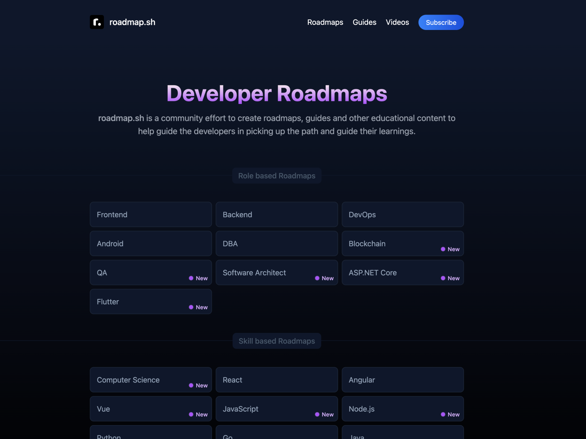

#first 
<Doctype!html>
    <html lang="ru">
    
        <head> 
            <link rel="stylesheet" href="styless.css">
           
            <link rel="stylesheet" href="STLbatton.css">
            <title> Zero </title> 
            <!--Коммент тест-->
        <body>
            <h1 style="color: rgb(7, 128, 128);font-size:160%;margin-left:30px;;">First project   Name <mark>"GG"</mark> </h1>
                
 моя mini string 

                <pre> <em>
                    итс э фэшн
                    итс э фабрикс
                </em>
                </pre>
                

        
            <h2> <del> second project </del> </h2>
                <a title= "last chapter" href="https://www.w3schools.com/html/html_css.asp"  a>
                
 Teacher 

                    

                <a href="malito:nikkudvryavtsev.tmn@gmail.com">   developer   </a>

              ITS A BUTTON  
            <a href="https://www.w3schools.com/html/tryit.asp?filename=tryhtml_links_button" target="_blank"> click me pls </a>
    
        </body>
        </head> 
  
</Doctype!html>
